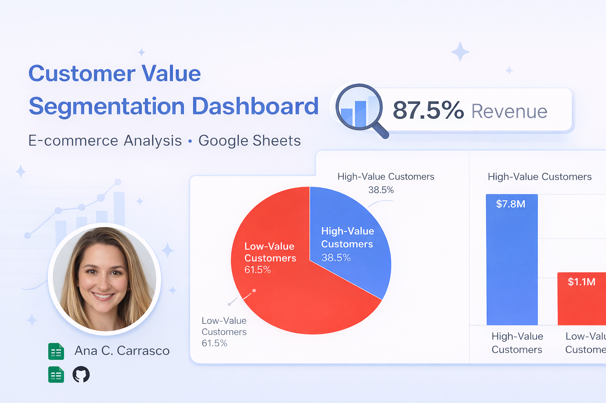

*This dashboard explores how revenue is distributed across customers, revealing the degree to which business performance depends on a small group of high-value buyers.*

# Customer Value Segmentation Dashboard — E-commerce Analysis (Google Sheets)

**Author:** Ana C. Carrasco  
**Tools:** Google Sheets, Pivot Tables, KPI Scorecards, Data Visualization  
**Dataset:** Online Retail (UCI / Kaggle – Open Dataset)

---

## 📌 Overview

This dashboard analyzes **customer value concentration** in an e-commerce dataset, focusing on how revenue is distributed across customer segments.

Rather than looking at products or markets, this analysis answers a different business question:

> *Who actually drives revenue, and how concentrated is that dependency?*

---

## 🎯 Business Objective

The goal of this dashboard is to:

- Identify **high-value vs low-value customers**
- Measure how much revenue depends on a small subset of customers
- Highlight potential **revenue concentration risk**
- Support decisions related to retention, loyalty, and customer strategy

---

## 🧠 Methodology

Customers were segmented based on **total revenue contribution**:

- **High-Value Customers:** Customers with above-average total revenue
- **Low-Value Customers:** Customers with below-average total revenue

All calculations were performed using aggregated customer-level metrics derived from transactional data.

---

## 📊 Key KPIs

- **Total Customers:** 4,338  
- **High-Value Customers:** 1,668 (38.45%)  
- **Total Revenue:** $8.91M  
- **Revenue from High-Value Customers:** $7.80M (87.57%)

---

## 📈 Visual Insights

### Customer Distribution by Value Segment
Shows the proportion of customers classified as high-value vs low-value.

### Revenue Concentration by Customer Type
Demonstrates how a relatively small customer segment accounts for the vast majority of revenue.

---

## 🔍 Key Insights

- **38.45% of customers generate 87.57% of total revenue**
- Revenue is highly concentrated among high-value customers
- The business is **strongly dependent on customer retention**
- Loss of a small group of customers could significantly impact revenue

---

## 🧩 How This Fits in the Portfolio

This dashboard complements the **Global Sales Performance Dashboard (Option A)**:

- **Option A:** What is happening? (sales trends, markets, products)
- **Option B:** Who is driving it? (customer value & concentration)

Together, they form a complete analytical story from **operations → customers → risk**.

---

## 📂 Files

- 📊 Google Sheets Dashboard ([linked](https://docs.google.com/spreadsheets/d/1qNgzmTi4Qmoi4xFB32c1-UFSO5Z7OxLaZCqFV_hha9c/edit?usp=sharing))
- 🗂️ GitHub Repository ([option A](https://github.com/anacarolcarrascoconsultorias-lab/ecommerce_performance_a))

---

## 🚀 Next Steps (Optional Extensions)

- RFM segmentation
- Cohort analysis
- Customer lifetime value (CLV) modeling
- Retention vs acquisition comparisons
